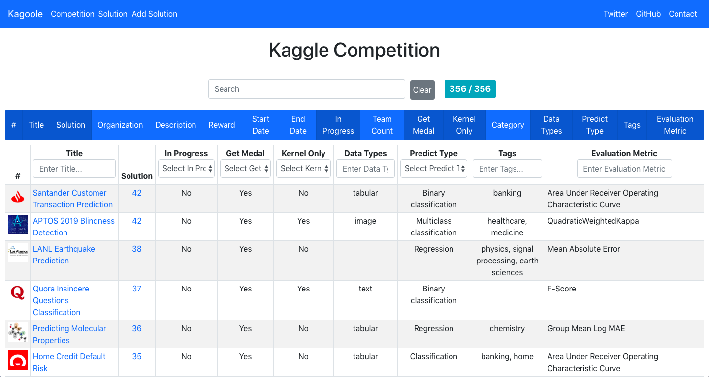

# [Kagoole](https://kagoole.herokuapp.com)

Search [Kaggle](https://www.kaggle.com) competitions and solutions based on data and predict type, evaluation metric, etc.



[This](https://twitter.com/kagoole) is Twitter account that tweet when new Kaggle competition is launched and competition deadline is changed.


## Requirements

- [Kaggle API](https://github.com/Kaggle/kaggle-api)
- docker-compose
- npm

## Usage

### 1. init

```sh
git clone https://github.com/Doarakko/kagoole
cp .env.example .env
cp frontend/.env.example frontend/.env
```

Enter your Kaggle username and key to `.env`.

```
KAGGLE_KEY=bbbb
KAGGLE_USERNAME=cccc
```

### 2. Run backend

```sh
docker-compose up
```

### 3. Migrate

```sh
docker exec -it kagoole_backend python manage.py makemigrations kagoole
docker exec -it kagoole_backend python manage.py migrate
```

### 4. Initialize Kaggle data

```sh
docker exec -it kagoole_backend python manage.py runscript starter
```

Check `http://0.0.0.0:8000`.

### 5. Run frontend

```sh
npm install
npm start
```

Go to `http://localhost:3000`!

## Contribution

Welcome issue and pull request.

## License

MIT

## Author

Doarakko
